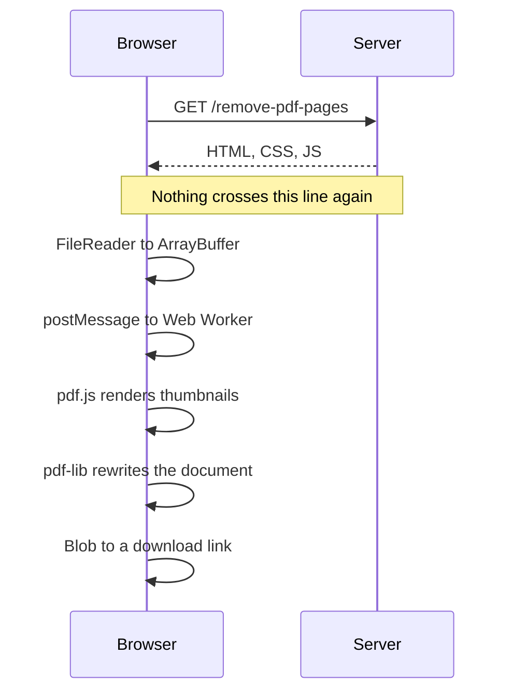

# RetroPDF

PDF tools that run in your browser. Files are never uploaded.

Merge, split, rotate, reorder, delete and extract pages, and convert between
PDF and images. Every operation happens on the user's own device.

## Why

Most free PDF sites send your document to their server, change it there and
send it back. RetroPDF does the work in the page you are looking at, so the
file never leaves the machine it is already on.

That is enforced rather than promised. Every response carries
`connect-src 'none'`, which tells the browser to refuse every outbound
request the page might make. A bug or a bad change cannot send a document
anywhere, because the browser will not allow it.

The cost is real: this site can never carry analytics, advertising, error
reporting or any third party script, since all of those work by sending data
somewhere. That is a deliberate trade.

## Running it

Requires Python 3.12 and Node 20 or newer.

```bash
python -m venv .venv
.venv/Scripts/activate        # Linux and macOS: source .venv/bin/activate
pip install -r requirements.txt -r requirements-dev.txt
npm install

uvicorn app.main:app --reload
```

Then open http://127.0.0.1:8000.

To reach it from a phone on the same network, bind to every interface and use
the machine's local address:

```bash
uvicorn app.main:app --host 0.0.0.0 --port 8000
```

## Tests

```bash
python -m pytest tests/          # routes, headers, the counter, languages
npm test                         # PDF operations and limits
node tests/tools.e2e.mjs         # every tool, end to end, in a real browser
node tests/edge.e2e.mjs          # locked, corrupt and oversized files
node tests/responsive.e2e.mjs    # layout across phone and desktop sizes
node tests/privacy.e2e.mjs       # the claim itself: nothing leaves the browser
```

`privacy.e2e.mjs` is the one worth running yourself. It drives a real PDF
through a real browser while recording every request, then deliberately tries
to send data out by five different routes to confirm the browser refuses. The
claim on the site is only worth what that test says.

The browser suites need the server running first. They are the layer the unit
tests cannot reach: the tools are driven through a real browser with real
PDFs, which is where a corrupt merge output was originally found.

---

# Architecture

## The one decision everything follows from

**PDF processing happens in the browser. Files are never uploaded.** The
server sends HTML, CSS and JavaScript, and never receives a PDF.

This is not a privacy preference bolted on afterwards. It determines the
stack, the scaling story and the marketing claim:

- **Privacy is provable.** Open DevTools, watch an empty Network tab, or
  disconnect from the internet and keep working. No competitor running
  server side can say this.
- **Load is flat.** Ten thousand merges an hour costs the same as ten,
  because the server only handed out a static page.
- **Security is structural.** A malicious PDF can only attack the tab it was
  opened in, inside the browser sandbox. Server side tools parse untrusted
  files on infrastructure holding other users' data.

The trade: very large files may exceed what a phone can hold in memory. We
fail with a clear message rather than silently uploading.

## Request flow



The server's entire job is choosing which title, heading and initial mode the
page ships with. It has no API for PDF operations, because there is nothing
for it to do.

## Stack

| Layer | Choice | Why |
|---|---|---|
| PDF manipulation | `@cantoo/pdf-lib` | The original `pdf-lib` has had no release since 2021. This fork is maintained and adds encrypted PDF support. Same API. |
| PDF rendering | `pdfjs-dist` | The only way to draw page thumbnails. pdf-lib cannot render. |
| Threading | Web Worker | A 50MB PDF on the main thread freezes the tab. Not slows, freezes. |
| Frontend | Vanilla JS modules | No framework earns its weight here. |
| Server | FastAPI | Serves HTML per route. Deliberately thin. |
| Proxy and TLS | Caddy | Automatic HTTPS, simple config. |
| Hosting | Any small VM | Sufficient, because the server does no work. |

Both PDF libraries are **vendored into the repo**, not loaded from a CDN. A
CDN request is a third party contact, which would undermine both the privacy
claim and the CSP.

## Security

The Content Security Policy is the load bearing part:

| Directive | Effect |
|---|---|
| `connect-src 'none'` | No fetch, XHR, WebSocket or beacon. Files cannot leave. |
| `script-src 'self'` | No CDN, no inline script, no eval. |
| `frame-ancestors 'none'` | Nobody can frame the site and watch what you do. |
| `form-action 'none'` | No form can post anywhere. |

`script-src 'self'` also closes off the class of bug behind CVE-2024-4367 in
pdf.js, where a crafted document could run code in the page. pdf.js is
additionally started with `isEvalSupported: false`.

## Performance

In order of impact:

1. **Web Worker for all PDF work.** The main thread handles file selection
   and progress only.
2. **Transfer ArrayBuffers rather than copying.** `postMessage(buf, [buf])`
   transfers ownership. For a 100MB file that is the difference between
   100MB and 200MB of memory.
3. **Process sequentially.** Peak memory tracks the largest single file, not
   the total.
4. **Render thumbnails lazily**, only visible pages, via IntersectionObserver.
5. **Animate only `transform` and `opacity`.** Anything else forces layout.

Worth knowing: merge cost scales with **object count, not file size**. PDFs
store content as a graph of objects with a cross reference table, and merging
renumbers every object and rebuilds the table. A 5MB file with 50,000 small
objects is slower than a 50MB scan.

WebAssembly was considered and rejected: it wins on small inputs but loses on
large ones and uses more memory, which is the opposite of what this workload
needs.

## Interaction rules

These exist because the product must work for people who are not comfortable
with computers. They are requirements, not preferences.

1. **Plain language.** "Choose a PDF", not "Upload".
2. **Big targets.** Primary buttons at least 48px tall.
3. **One primary action on screen at a time.**
4. **Say what will happen.** "Remove 2 pages and download 10" beats "Apply".
5. **Undo instead of confirm.** Confirmation dialogs get dismissed reflexively.
6. **Drag is never the only way.** Every drag has button equivalents.
7. **Nothing hidden.** No hover to reveal, no right click menus.

## Languages

Each language gets its own addresses, because that is what search engines
index. English keeps the plain addresses it already had, so nothing that has
been linked to moves:

```
/merge-pdf          English
/es/merge-pdf       Spanish
/zh/merge-pdf       Chinese
```

Text lives in `app/translations/*.json`, one file per language, and templates
look up keys. A missing key falls back to English, so a half finished
translation is a page with some English in it rather than a broken one.

## The desktop app counter

The site keeps exactly one number: how many people pressed a button asking
for a desktop app. Collecting email addresses would answer the same question
and undercut the promise the site makes, so the button is an ordinary link and
the server counts the request it was already handling.

Only a request carrying `?ask=1` counts, and the address is rewritten
afterwards, so reloading shows the number without adding to it. The browser
remembers you asked, which stops the ordinary repeats. Someone determined can
clear their storage and count again, and the page says so.

## Layout

```
app/
  main.py          routes, one per tool page and language
  languages.py     the languages the site is published in
  interest.py      the desktop app counter
  security.py      the response headers, including the CSP
  tools.py         one definition per tool, driving routes and titles
  templates/
  translations/    one JSON file per language
  static/
    js/
      worker.js    all PDF work happens off the main thread
      tools/       per tool logic
      vendor/      pdf-lib and pdf.js, committed rather than from a CDN
tests/
deploy/            Dockerfile, compose and Caddy config
```

## Deliberately not built

- **An upload endpoint.** There is nothing for it to do.
- **Accounts.** Nothing to store, so nothing to secure or leak.
- **Analytics.** Ruled out by the CSP, deliberately.
- **A framework.** Revisit only with evidence that one is needed.

## Deployment

See [DEPLOYMENT.md](DEPLOYMENT.md).

## Licence

MIT. See [LICENSE](LICENSE).
